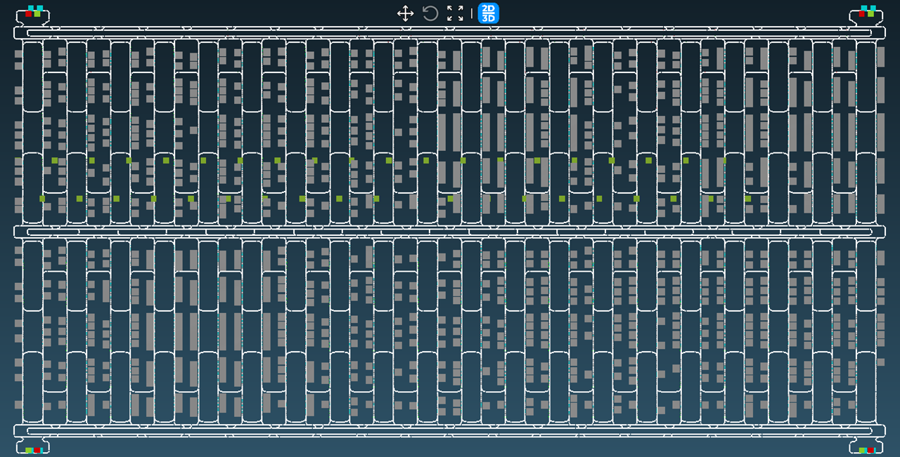

# README.md

### SMAT2022 (Will be presented in WinterSim 2022)

---

**Authors: Kwanwoo Lee, Siyong Song, Daesoon Chang, Sangchul Park**

The repository contains a simulation dataset, SMAT2022. [(Kopp et al, 2020)](https://ieeexplore.ieee.org/document/9115710) propose a new dataset, SMT2020, containing characteristics of modern FAB. SMAT2022 is an additional version of SMT2020 including AMHS (Automated Material Handling System). We tried to reflect the details of AMHS in modern FAB.

### Description

---

- As Kopp suggested, This dataset includes four models (HVLM, LVHM, HVLM_E, LVHM_E) with AMHS attributes. Each model is provided in Excel file format (XLSX). We provide the original version of the SMT2020 dataset in a folder named ‘SMT2020’ (or you can access it at [https://p2schedgen.fernuni-hagen.de/index.php/downloads/simulation](https://p2schedgen.fernuni-hagen.de/index.php/downloads/simulation)).
- There are eight additional sheets to describe AMHS in modern fabs as follows:
    - Address
    - Rail
    - Bay
    - Equipment
    - PortType
    - Port
    - VehicleType
    - Vehicle
    - ZCU
- Additional specifications about the above sheets are suggested in the file named ‘SMAT_2022_generic_format’.
- Finally, We would like to share a simple simulator that can open these simulation model files. This simulator is a demo version of PINOKIO, Carlo. It is possible to use the simulator by installing ‘Pinokio_Demo.exe’. It only works in Windows environments. For detailed usage, refer to the file ‘PinokioGuide’.

### **Acknowledgment**

---

**Thanks to all authors of SMT 2020, Denny Kopp, Michael Hassoun, Adar Kalir, and Lars Monch.**

This work was supported by the National Research Foundation (NFR-2020R1A2C1004544) grant by the Korean government (MSIT); and the Institute for Information and Communications Technology Promotion (IITP-2021000292) grant funded by the Korean government (MSIT).

### Contact

---

Kwanwoo Lee, +82-10-8790-2231, cool8790@ajou.ac.kr

### References

---

[1] Brain, M., R. Gould, U. Kaempf, and B. Wehrung. 1999. “Emerging Needs for Continuous Flow FOUP Transport”. In International Electronics Manufacturing Technology Symposium 1999 24th IEEE/CPMT, 76–82. Piscataway, New Jersey: Institute of Electrical and Electronics Engineers, Inc.

[2] Campbell, E., and J. Ammenheuser. 2000. “300mm Factory Layout and Material Handling Modeling: Phase II Report”. Technical Report No. 99113848B-ENG, SEMATECH, Austin, Texas.

[3] Castillo, I., and B. A. Peters. 2004. “Integrating Design and Production Planning Considerations in Multi-Bay Manufacturing Facility Layout”. European Journal of Operational Research 157(3):671–687.

[4] Chang, X., M. Dong, and D. Yang. 2013. “Multi-Objective Real-Time Dispatching for Integrated Delivery in a Fab Using GA Based Simulation Optimization”. Journal of Manufacturing Systems 32(4):741–751.

[5] Fowler, J. W., L. Monch, and T. Ponsignon. 2015. “Discrete-Event Simulation for Semiconductor Wafer Fabrication Facilities: ¨a Tutorial”. International Journal of Industrial Engineering: Theory, Applications and Practice 22(5):661–682.

[6] Fowler, J. W., and J. C. Robinson. 1995. “Measurement and Improvement of Manufacturing Capacities (MIMAC): Final Report”. Technical Report No. 95062861A-TR, SEMATECH, Austin, Texas.

[7] Gaxiola, G., D. Pabst, E. Christensen, and D. Wizelman. 2013. “Methodology to Evaluate the Impact of AMHS Design Characteristics on Operational Fab Performance”. In Proceedings of the 2013 Winter Simulation Conference, edited by R. Pasupathy, S.-H. Kim, A. Tolk, R. R. Hill, and M. E. Kuhl, 3806–3817. Piscataway, New Jersey: Institute of Electrical and Electronics Engineers, Inc. 

[8] Hassoun, M., and A. Kalir. 2017. “Towards a New Simulation Testbed for Semiconductor Manufacturing”. In Proceedings of the 2017 Winter Simulation Conference, edited by V. W. K. Chan, A. D’Ambrogio, G. Zacharewicz, N. Mustafee, G. Wainer, and E. H. Page, 3612–3623. Piscataway, New Jersey: Institute of Electrical and Electronics Engineers, Inc. 

[9] Hassoun, M., D. Kopp, L. Monch, and A. Kalir. 2019. “A New High-Volume/Low-Mix Simulation Testbed for Semiconductor Manufacturing”. In Proceedings of the 2019 Winter Simulation Conference, edited by N. Mustafee, K.-H. G. Bae, S. Lazarova-Molnar, M. Rabe, C. Szabo, P. Haas, and Y.-J. Son, 2419–2428. Piscataway, New Jersey: Institute of Electrical and Electronics Engineers, Inc.

[10] Kim, J., G. Yu, and Y. J. Jang. 2016. “Semiconductor FAB Layout Design Analysis With 300-mm FAB Data: Is Minimum Distance-Based Layout Design Best for Semiconductor FAB Design?”. Computers & Industrial Engineering 99(C):330–346.

[11] Kopp, D., M. Hassoun, A. Kalir, and L. Monch. 2020. “SMT2020—A Semiconductor Manufacturing Testbed”. ¨ IEEE Transactions on Semiconductor Manufacturing 33(4):522–531.

[12] Monch, L., J. W. Fowler, and S. Mason. 2013. ¨ Production Planning and Control for Semiconductor Wafer Fabrication Facilities: Modeling, Analysis, and Systems. New York, New York.

[13] Tung, J., T. Sheen, M. Kao, and C. Chen. 2013. “Optimization of AMHS Design for a Semiconductor Foundry Fab by Using Simulation Modeling”. In Proceedings of the 2013 Winter Simulation Conference, edited by R. Pasupathy, S.-H. Kim, A. Tolk, R. R. Hill, and M. E. Kuhl, 3829–3839. Piscataway, New Jersey: Institute of Electrical and Electronics Engineers, Inc.

[14] Wowk, V., and R. Billings. 1994. “Vibration and Shock from Manual and Automated Material Movement”. Technical Report No. 94102603A-GEN, SEMATECH, Austin, Texas.

[15] Yang, T., and B. Peters. 1998. “A Spine Layout Design Method for Semiconductor Fabrication Facilities Containing Automated Material Handling Systems”. International Journal of Operations & Production Management 17(6):490–501.

**Last Revised at 22.11.21 by Kwanwoo Lee.**